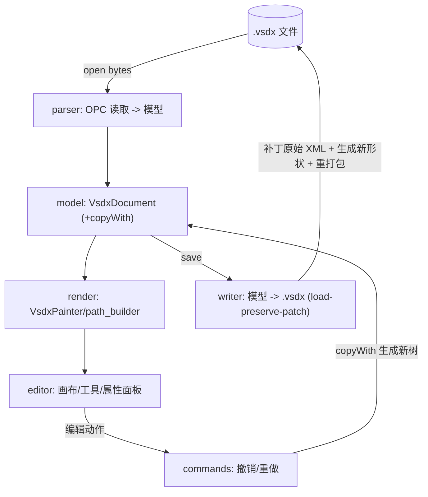

# 架构设计（Architecture）

> 配套：[`PLAN.md`](./PLAN.md) · [`VSDX_WRITE.md`](./VSDX_WRITE.md) ·
> [`REUSE_MAP.md`](./REUSE_MAP.md) · [`VSDX_FORMAT.md`](./VSDX_FORMAT.md)

## 1. 设计原则

1. **原生 Dart 往返**：直接读写 `.vsdx`（OPC/ZIP + XML），不依赖 libvisio。libvisio 仅作
   算法阅读参考（老格式 `.vsd` 导入为 v0.1 之后事项）。
2. **引擎与 UI 解耦**：`packages/vsdx` 是**纯 Dart**（无 Flutter），可在 CLI/服务端/测试
   复用；Flutter 只在 `lib/`（渲染 + 编辑 UI）。
3. **模型是唯一真源**：解析产出 `VsdxDocument`；渲染、编辑、写回都以它为中心。模型
   `@immutable` + `copyWith`，编辑通过命令生成新树，天然支持 undo/redo。
4. **保真优先**：写回以 **load-preserve-patch** 为主，只改用户显式编辑过的 Cell，其余
   part/节/公式原样透传。

## 2. 分层总览

```
┌───────────────────────────────────────────────────────────┐
│  App / Editor UI  (lib/app, lib/editor)      [Flutter]      │
│   - MaterialApp / 菜单 / 工具栏 / 属性面板 / 页签           │
│   - 画布(InteractiveViewer+CustomPaint) / 选择 / 变换手柄   │
│   - commands: 撤销/重做命令栈                               │
└───────────────────────────┬───────────────────────────────┘
                            │ uses
┌───────────────────────────▼───────────────────────────────┐
│  Render  (lib/render)                          [Flutter]    │
│   - VsdxPainter(CustomPainter) / path_builder               │
│   - arrow_library / pattern_fill / shape_bounds / dash_path │
└───────────────────────────┬───────────────────────────────┘
                            │ uses model
┌───────────────────────────▼───────────────────────────────┐
│  package:vsdx                                  [纯 Dart]    │
│   model/   VsdxDocument/Page/Shape/Geometry/... (+copyWith) │
│   parser/  OPC ZIP + XML  ->  model                         │
│   writer/  model  ->  OPC ZIP (.vsdx)   ← 新增              │
│   formula/ 公式只读求值                                     │
│   core/ utils/  异常/结果/单位/颜色/变换/xml 助手           │
└────────────────────────────────────────────────────────────┘
```

## 3. 数据流



## 4. 目录结构

```
visioeditor/
├── docs/                       # 规划与格式文档
├── third_party/                # 参考克隆（不入库）
├── packages/vsdx/              # 纯 Dart 引擎  => package:vsdx
│   └── lib/
│       ├── vsdx.dart           # 公共导出面
│       └── src/{core, utils, model, parser, writer, formula}
└── lib/
    ├── main.dart
    ├── app/                    # MaterialApp / 主题 / 菜单 / i18n
    ├── render/                 # 模型 -> Flutter Path/Canvas（自查看器恢复）
    ├── editor/                 # 画布 / 选择 / 变换 / 工具 / 属性面板
    ├── commands/               # 命令栈（undo/redo）
    └── io/                     # 打开/保存/最近文件/文件关联
```

## 5. 与查看器（visiovsdxviewer）的关系

- **不共享运行期代码/仓库**。编辑器从查看器 **git 历史**（`0fcaf66^`，pre-pivot 纯 Dart 栈，
  MIT）**一次性恢复** model/parser/render 作为起点，此后独立演进。恢复清单与改动见
  [`REUSE_MAP.md`](./REUSE_MAP.md)。
- 查看器现役的 libvisio→FFI→IR 管线**不复用**（有损只读，不能回写）。

## 6. 关键设计决策（详见 PLAN §13 ADR）

- 引擎独立成纯 Dart 包，便于无 Flutter 往返单测。
- 编辑用不可变模型 + copyWith + 命令栈，而非可变对象图。
- 写回优先 load-preserve-patch，保真透传未知结构。

## 7. 性能预算（初版目标，macOS）

- 打开中等文件（< 2MB，数百 shape）解析 < 300ms；首帧渲染 < 500ms。
- 拖动/变换 60fps（选中子树重绘，使用 picture 缓存于非交互层）。
- 保存（补丁写回）< 300ms（仅重写受影响 part + 重打包）。
