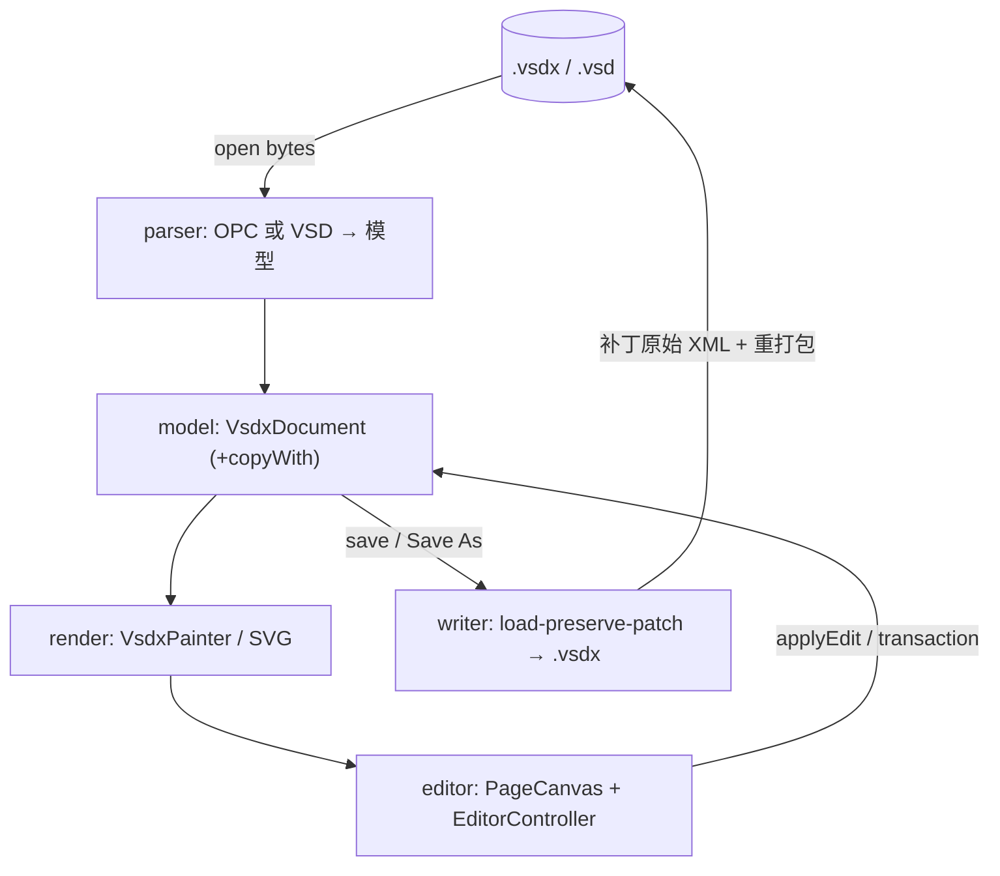

# 架构设计（Architecture）

> 配套：[`PLAN.md`](./PLAN.md) · [`VSDX_WRITE.md`](./VSDX_WRITE.md) ·
> [`REUSE_MAP.md`](./REUSE_MAP.md) · [`VSDX_FORMAT.md`](./VSDX_FORMAT.md) ·
> [`QA_AUDIT.md`](./QA_AUDIT.md)

## 1. 设计原则

1. **原生 Dart 往返**：直接读写 `.vsdx`（OPC/ZIP + XML），不依赖 libvisio FFI。libvisio
   仅作算法/oracle 参考。遗留 `.vsd`（OLE2）可**导入**为 `VsdxDocument` 并另存 `.vsdx`；
   **无**二进制 `.vsd` 写回。
2. **引擎与 UI 解耦**：`packages/vsdx` 是**纯 Dart**（无 Flutter），可在 CLI/MCP/服务端/测试
   复用；Flutter 只在 `lib/`（渲染 + 编辑 UI + Agent 实时桥）。
3. **模型是唯一真源**：解析产出 `VsdxDocument`；渲染、编辑、写回都以它为中心。模型
   `@immutable` + `copyWith`；`EditorController` 以文档快照做 undo/redo（无独立
   `lib/commands/` 包）。
4. **保真优先**：写回以 **load-preserve-patch** 为主，只改用户显式编辑过的 Cell，其余
   part/节/公式原样透传。

## 2. 分层总览

```
┌───────────────────────────────────────────────────────────┐
│  App shell  (lib/main.dart + lib/editor + lib/l10n)       │
│   - MaterialApp / 菜单 / 工具栏 / 属性面板 / 多文档 Tab     │
│   - PageCanvas 手势 / EditorController 编辑命令 + undo     │
│   - AgentBridge（可选 live preview）                       │
└───────────────────────────┬───────────────────────────────┘
                            │ uses
┌───────────────────────────▼───────────────────────────────┐
│  Render / IO  (lib/render, lib/io)             [Flutter]    │
│   - VsdxPainter / path_builder / dash_path / arrows         │
│   - document_io · SVG/PNG/PDF 导出                          │
└───────────────────────────┬───────────────────────────────┘
                            │ uses model
┌───────────────────────────▼───────────────────────────────┐
│  package:vsdx                                  [纯 Dart]    │
│   model/   VsdxDocument/Page/Shape/Geometry/... (+copyWith) │
│   parser/  OPC ZIP+XML · VSD OLE2 · metafile                │
│   writer/  model → OPC ZIP (.vsdx) load-preserve-patch      │
│   export/  SVG serializer                                   │
│   agent/   DiagramSpec · edit_ops · MCP/CLI 入口            │
│   formula/ 公式只读求值                                     │
│   core/ utils/  异常/结果/单位/颜色/变换/xml 助手           │
└────────────────────────────────────────────────────────────┘
```

## 3. 数据流



Agent 旁路：`edit_ops` / MCP / CLI → 同一 `VsdxDocument`（可选经 `AgentBridge` 推到运行中的 App）。

## 4. 目录结构（与仓库一致）

```
visioeditor/
├── docs/                       # 规划、格式、QA 验收
├── packages/vsdx/              # 纯 Dart 引擎 => package:vsdx
│   ├── lib/
│   │   ├── vsdx.dart / agent.dart
│   │   └── src/{core,utils,model,parser,writer,export,agent,formula}
│   ├── bin/                    # vsdxtool · vsdxtool-mcp
│   ├── test/fixtures/          # 引擎往返样例（dave-howard + 中文等）
│   └── tool/                   # edraw_roundtrip_check 等探针
├── assets/examples/            # 应用内置样例图
├── lib/
│   ├── main.dart               # 应用壳（菜单/快捷键/属性面板编排）
│   ├── editor/                 # EditorController · PageCanvas · 面板
│   ├── render/                 # VsdxPainter · path_builder · …
│   ├── io/                     # 打开/保存/导出/最近文件
│   ├── agent_bridge/           # 实时预览 WebSocket 桥
│   ├── l10n/ · settings/ · templates/
│   └── …
├── test/                       # Flutter / Controller / 画布 widget 测试
└── macos/ …                    # 桌面工程（首发目标）
```

> **已废弃的规划路径**：早期文档中的 `lib/app/`、`lib/commands/` **不存在**；壳层在
> `main.dart`，undo 内嵌于 `EditorController`。

## 5. 与查看器（visiovsdxviewer）的关系

- **不共享运行期代码/仓库**。编辑器从查看器 **git 历史**（`0fcaf66^`，pre-pivot 纯 Dart 栈，
  MIT）**一次性恢复** model/parser/render 作为起点，此后独立演进。恢复清单与改动见
  [`REUSE_MAP.md`](./REUSE_MAP.md)。
- 查看器现役的 libvisio→FFI→IR 管线**不复用**（有损只读，不能回写）。可选 CI oracle：
  `libvisio_diff_test`（需 `native/build.sh`）。

## 6. 关键设计决策（详见 PLAN §13 ADR）

- 引擎独立成纯 Dart 包，便于无 Flutter 往返单测与 CLI/MCP。
- 编辑用不可变模型 + copyWith + Controller 快照栈，而非可变对象图。
- 写回优先 load-preserve-patch，保真透传未知结构。

## 7. 性能预算（初版目标，macOS）

- 打开中等文件（< 2MB，数百 shape）解析 < 300ms；首帧渲染 < 500ms。
- 拖动/变换 60fps（选中子树重绘，使用 picture 缓存于非交互层）。
- 保存（补丁写回）< 300ms（仅重写受影响 part + 重打包）。
